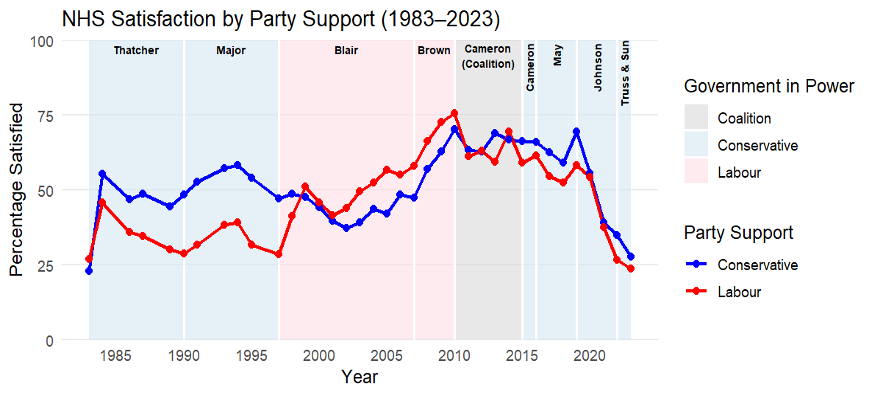

# NHS Dissatisfaction & Political Leanings

This project investigates whether public dissatisfaction with the UK's National Health Service (NHS) is shaped by **political leanings**, using British Social Attitudes (BSA) survey data from 2015–2019 and 2021–2023.

## 🧭 Overview

The study asks:  
*Are the reasons people give for feeling dissatisfied with the NHS rooted in ideological differences?*

Using party identification as a proxy for political leaning, it compares **Labour (left)**, **Conservative (right)**, and **Unaffiliated** individuals. Demographic controls include age, sex, ethnicity, education, employment status, and pandemic-related temporal effects.

---

## 🔍 Key Insights

- **Labour supporters** blame systemic issues like under-funding, staff shortages, and policy reform.
- **Conservative supporters** focus on perceived waste and operational inefficiency.
- **Unaffiliated individuals** cite long waiting times and service unavailability.
- **Older adults** and **employed respondents** are consistently more dissatisfied.
- **COVID-19 years** (2021–2022) produced a cross-cutting spike in dissatisfaction.

---

## ⚙️ Techniques Used

- **Data Wrangling & Visualisation**: R (`tidyverse`, `ggplot2`, `janitor`)
- **Exploratory Analysis**:
  - NHS satisfaction trends (1983–2023)
  - Phi and Cramér’s V association tests
- **Modeling**:
  - Stepwise logistic regression:
    - Model 0: Political leaning
    - Model 1: + Year fixed effects
    - Model 2: + Age & interactions
    - Model 3: + Full demographic controls
- **Model Evaluation**: Log odds coefficients, McFadden’s pseudo-R², AIC

---

## 📊 Sample Visuals

| NHS Satisfaction by Party (1983–2023) | Logistic Regression Coefficients |
|--------------------------------------|----------------------------------|
 | (Logistic Regression with NHS Dissatisfaction.png) |

## 📊 Key Results

### Table 1: Logistic Regression – Overall NHS Dissatisfaction

This table shows four stepwise models evaluating the effect of political leaning, age, employment, and other demographic factors on overall NHS dissatisfaction. Model 3 includes full controls and interactions.

---

### Table 2: Logistic Regression – NHS Dissatisfaction Reasons (WhyDis01–09)

This model uses "No Party" as the reference group and estimates dissatisfaction across nine complaint types, showing how each is predicted by political affiliation, age, employment, and other controls.

> *Note: Figures automatically scale if placed in a `figs/` subfolder.*

## 📌 Citation

Data Source:  
> British Social Attitudes Survey 2015–2023, NatCen Social Research.

*Created by Jacky Chong (2025)*  
[Back to Portfolio ➜](https://github.com/JackyChong611/PortfolioProjects)

