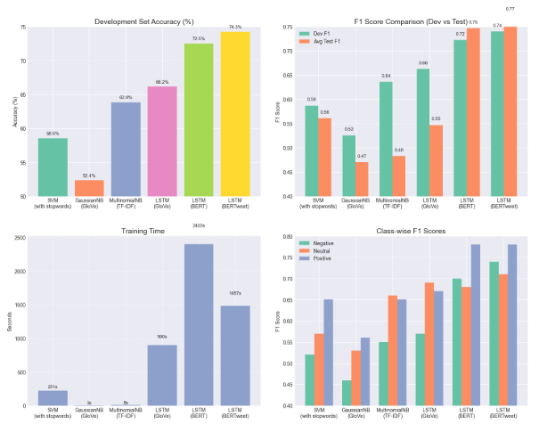

# Portfolio Projects

Welcome to my Data Science and NLP portfolio! Below is an overview of each project, along with links to more detailed documentation and code.

## Table of Contents
1. [Twitter Sentiment Analysis with NLP](#twitter-sentiment-analysis-with-nlp)
2. [COVID-19 Vaccination & All-Cause Mortality Analysis](#covid-19-vaccination--all-cause-mortality-analysis)
3. [Web Scraping & Data Cleansing Tool](#web-scraping-and-data-cleansing-tool)

## Twitter Sentiment Analysis with NLP
**Overview**:
This project explores sentiment classification on SemEval 2017 tweets, comparing traditional machine learning (SVM, Naive Bayes) with deep learning (LSTM) using GloVe, BERT, and BERTweet embeddings. Key experiments include handling Twitter-specific text, assessing stopword removal, and measuring performance via accuracy and F1 scores.

-**Path to code**: [`/Twitter_Sentiment_Analysis`](./Twitter_Sentiment_Analysis/Twitter%20Sentiment%20Analysis%20with%20Natural%20Language%20Processing.ipynb)

- **Insights**:
  - Traditional models like MultinomialNB and SVM performed reasonably well with significantly shorter training times.
  - Stopword retention slightly improved SVM’s performance, suggesting syntactic cues contribute to sentiment signals.
  - Contextual embeddings (BERT, BERTweet) offered clear improvements in class-wise F1 scores, particularly on nuanced or informal text.

Read more in the [detailed documentation](./Twitter_Sentiment_Analysis/README.md).

## COVID-19 Vaccination & All-Cause Mortality Analysis
**Overview**
This project investigates the relationship between COVID-19 vaccination and all-cause mortality in England using publicly available data from the **UK Office for National Statistics (ONS). While clinical trials confirm vaccine efficacy in reducing COVID-specific deaths, this study focuses on broader mortality patterns across age groups from April 2021 to May 2023.

- **Insights**:
  - Vaccination is consistently associated with lower all-cause mortality, especially after the third and fourth doses.
  - Elevated risk among early first-dose recipients likely reflects indication bias (high-risk populations prioritized).
  - Negative Binomial regression confirms statistically significant mortality reductions across all vaccinated groups.
  - Consideration of biases (healthy vaccinee effect, harvesting effect) is crucial for accurate interpretation.

- **Techniques Used**:
  - Rate Ratio (RR) analysis
  - Poisson & Negative Binomial regression (to account for overdispersion)
  - Data cleaning & statistical visualization using R and ggplot2

📄 Read more in the [detailed documentation](./Real-World_COVID19_Analysis/README.md).

## Web Scraping and Data Cleansing Tool

This project is a **Python-based web scraping pipeline** designed to extract, clean, and export structured data from OpenRice Hong Kong. It focuses on licensed liquor premises and diverse restaurant listings across districts and cuisines.

The tool is optimized for performance using **multi-threading**, **Selenium**, and **BeautifulSoup**, with outputs saved in `.xlsx` format for further analysis or integration.

---

### 📌 Features

- Automated scraping with `requests`, `Selenium`, and `BeautifulSoup`
- Dynamic handling of 50+ cuisine types and 100+ district IDs
- Skips closed/relocated restaurants and handles HTML irregularities
- Multi-threaded scraping using `concurrent.futures` for speed
- Cleans and structures data with `pandas`
- Exports to Excel with `openpyxl`

-**Path to code**: [`/Web Scraping and Data Cleansing Tool`](./Web Scraping and Data Cleansing Tool.md)
